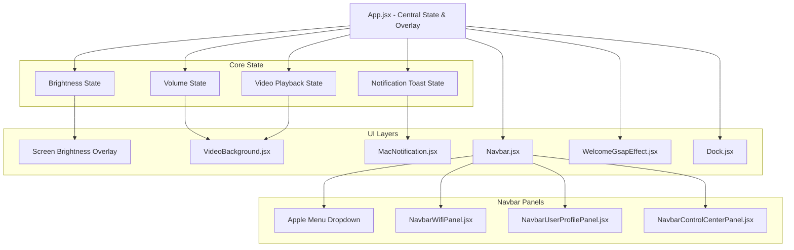
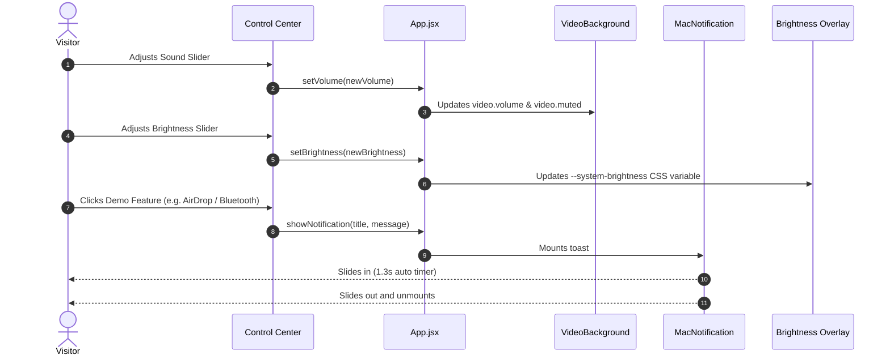

#  macOS Portfolio OS — React + GSAP + Tailwind

An ultra-realistic, interactive macOS-themed portfolio web application built with **React**, **Tailwind CSS**, and **GSAP Animations**. Designed with high-fidelity macOS Sequoia frosted glassmorphism, dynamic audio/brightness controls, and realistic desktop workflows.

---

## 🌟 Key Highlights & Features

- ** Authentic macOS Menubar**: Live ticking clock, Apple system dropdown, portfolio links, and interactive system tray icons.
- **🎛️ macOS Sequoia Control Center**:
  - 2-Column interactive connectivity grid (Wi-Fi, Bluetooth, AirDrop).
  - Focus / Do Not Disturb toggle with ambient styling.
  - Stage Manager & Screen Mirroring pills.
  - Display Brightness slider that dims/brightens the whole screen in real time.
  - Sound Volume slider with interactive mute/unmute control.
  - **Now Playing Media Widget** with animated audio equalizer waves and Play/Pause controls.
- **🔊 Live Ambient Video Audio**: Background video sound is dynamically controlled by the Control Center Sound slider.
- **⚡ Snappy macOS Notification Toasts**: Native macOS-style floating banners for simulated features with automatic 1.3s slide-in/out transitions.
- **👤 GitHub-Powered Apple Account Modal**: Pulls live GitHub avatar, bio, repository count, and follower stats, accompanied by an iCloud+ segmented storage bar.
- **🚀 Dynamic Dock & Windows**: Interactive macOS dock with GSAP hover scale animations.

---

## 📐 Architecture & System Flow

### 1. High-Level Architecture



---

### 2. User Interaction & State Workflow



---

## 📂 Project Structure

```text
├── public/
│   ├── icons/                  # SVG icons (wifi, user, mode, etc.)
│   ├── images/                 # App images and wallpapers
│   └── video-background/       # Background video loop
├── src/
│   ├── components/
│   │   ├── navbar-panels/
│   │   │   ├── NavbarControlCenterPanel.jsx   # Control Center with sliders & Now Playing
│   │   │   ├── NavbarWifiPanel.jsx            # Wi-Fi network selection & toggle
│   │   │   ├── NavbarUserProfilePanel.jsx     # GitHub profile & iCloud meter
│   │   │   └── NavbarBluetoothPanel.jsx       # Bluetooth device list
│   │   ├── Navbar.jsx                         # Main Menubar & icon dispatcher
│   │   ├── VideoBackground.jsx                # Video wallpaper with audio sync
│   │   ├── MacNotification.jsx                # Timed macOS notification toast
│   │   ├── WelcomeGsapEffect.jsx              # Welcome text animation
│   │   ├── Dock.jsx                           # Interactive bottom dock
│   │   └── index.js                           # Central component exports
│   ├── constants/
│   │   └── index.js                           # Navigation, dock apps, & projects data
│   ├── App.jsx                                # Root layout and global state
│   ├── index.css                              # Tailwind & macOS glassmorphism styles
│   └── main.jsx                               # Application entry point
├── package.json
└── vite.config.js
```

---

## 💻 Tech Stack

- **Framework**: React 19 + Vite
- **Styling**: Tailwind CSS v4 + Vanilla CSS Glassmorphism
- **Animation**: GSAP (GreenSock Animation Platform)
- **Icons & Assets**: Custom SVG icons & SF Pro typography
- **Data Integration**: GitHub REST API

---

## 🚀 Getting Started

### Prerequisites
- Node.js (v18 or higher)
- npm or yarn

### Installation
```bash
# Clone the repository
git clone https://github.com/Pratham707-S/Mac_OS_Portfolio_Practice_React_GSAP_Tailwind.git

# Navigate into the project folder
cd Mac_OS_Portfolio_Practice_React_GSAP_Tailwind

# Install dependencies
npm install

# Start local development server
npm run dev
```

The app will start at `http://localhost:5173/`.

---

## 👤 Author

**Pratham**
- GitHub: [@Pratham707-S](https://github.com/Pratham707-S)
