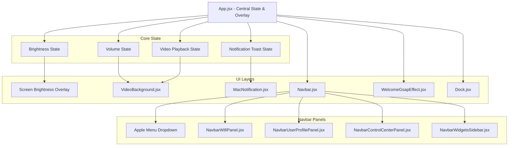
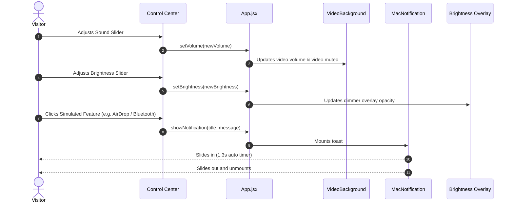

# macOS Portfolio OS — React + GSAP + Tailwind

[-orange?style=for-the-badge&logo=git)](https://github.com/Pratham707-S/Mac_OS_Portfolio_Practice_React_GSAP_Tailwind)
[](https://react.dev)
[](https://gsap.com)
[](https://tailwindcss.com)

> [!IMPORTANT]
> **Work in Progress / Active Development**
> This project is an interactive macOS-themed portfolio web application currently under active development. Core desktop features, window managers (Finder, Safari, Terminal), and interactive components are being incrementally engineered.

An interactive macOS-themed portfolio web application built with **React**, **Tailwind CSS**, and **GSAP Animations**. Designed with high-fidelity macOS Sequoia frosted glassmorphism, dynamic audio/brightness controls, and desktop simulation workflows.

---

## Key Highlights & Features

- **Authentic macOS Menubar**:
  - Live ticking clock with localized date formatting.
  - Apple system dropdown with system preferences and lock screen actions.
  - Interactive status tray items with real-time feedback.
- **macOS Sequoia Control Center**:
  - 2-Column interactive connectivity grid (Wi-Fi, Bluetooth, AirDrop).
  - Focus / Do Not Disturb state toggles.
  - Stage Manager and Screen Mirroring simulation controls.
  - Display Brightness slider that dims the viewport in real time.
  - Sound Volume slider with mute/unmute toggle.
  - Now Playing media card with animated equalizer waves and playback controls.
- **Notification Center & Widgets Sidebar**:
  - Full-height React Portal drawer triggered via menubar clock.
  - Interactive live calendar widget displaying current day and scheduled milestones.
  - Cupertino weather forecast widget.
  - 4-city real-time analog world clocks (Cupertino, Tokyo, Sydney, Paris).
  - Financial/tech stock ticker widget.
- **Ambient Audio Controller**:
  - Video wallpaper soundtrack with initial soft ambient volume level.
  - Automatic interaction unlocking complying with modern browser autoplay policies.
- **System Toast Notifications**:
  - Native floating macOS toast notifications for simulated features.
  - Automatic timed entry and exit slide animations.
- **User Profile Modal**:
  - Real-time GitHub REST API integration for user avatar, bio, and repository counts.
  - Segmented visual iCloud+ storage utilization bar.
- **Dynamic Dock**:
  - Fluid magnification physics powered by GSAP.

---

## Architecture & System Flow

### 1. High-Level Architecture



---

### 2. User Interaction & State Workflow



---

## Project Structure

```text
├── public/
│   ├── icons/                  # SVG system icons (wifi, user, mode, etc.)
│   ├── images/                 # App assets, wallpapers, and icons
│   └── video-background/       # Background video loop
├── src/
│   ├── components/
│   │   ├── navbar-panels/
│   │   │   ├── NavbarControlCenterPanel.jsx   # Control Center with sliders & Now Playing
│   │   │   ├── NavbarWidgetsSidebar.jsx       # Notification Center & Widgets drawer
│   │   │   ├── NavbarWifiPanel.jsx            # Wi-Fi network selection & toggle
│   │   │   ├── NavbarUserProfilePanel.jsx     # GitHub profile & iCloud meter
│   │   │   └── NavbarBluetoothPanel.jsx       # Bluetooth device list
│   │   ├── Navbar.jsx                         # Main Menubar & icon dispatcher
│   │   ├── VideoBackground.jsx                # Video wallpaper with audio sync
│   │   ├── MacNotification.jsx                # Timed macOS notification toast
│   │   ├── WelcomeGsapEffect.jsx              # Welcome text animation
│   │   ├── Dock.jsx                           # Interactive bottom dock
│   │   └── index.js                           # Central component exports
│   ├── hooks/
│   │   ├── useAudioController.js              # Ambient sound & autoplay hook
│   │   ├── useSystemBrightness.js             # Display brightness & overlay hook
│   │   ├── useSystemNotification.js           # Floating toast dispatcher hook
│   │   └── index.js                           # Central hooks barrel export
│   ├── utils/
│   │   └── timeZoneHelper.js                  # World clock rotation & timezone utils
│   ├── constants/
│   │   ├── index.js                           # Navigation, dock apps, & projects data
│   │   ├── systemAudioConfig.js               # Audio track configurations
│   │   └── widgetsConfig.js                   # Weather, stocks, and dev report data
│   ├── App.jsx                                # Root layout and global state orchestration
│   ├── index.css                              # Tailwind & macOS glassmorphism styles
│   └── main.jsx                               # Application entry point
├── package.json
└── vite.config.js
```

---

## Tech Stack

- **Framework**: React 19 + Vite
- **Styling**: Tailwind CSS v4 + Vanilla CSS Glassmorphism
- **Animation**: GSAP (GreenSock Animation Platform)
- **Typography & Icons**: Custom SVG icons with native SF Pro system fonts
- **Data Integration**: GitHub REST API

---

## Getting Started

### Prerequisites
- Node.js (v18 or higher)
- npm or yarn

### Installation
```bash
# Clone the repository
git clone https://github.com/Pratham707-S/Mac_OS_Portfolio_Practice_React_GSAP_Tailwind.git

# Navigate into the project folder
cd Mac_OS_Portfolio_Practice_React_GSAP_Tailwind

# Install dependencies
npm install

# Start local development server
npm run dev
```

The application will start at `http://localhost:5173/`.

---

## Author

**Pratham**
- GitHub: [@Pratham707-S](https://github.com/Pratham707-S)
