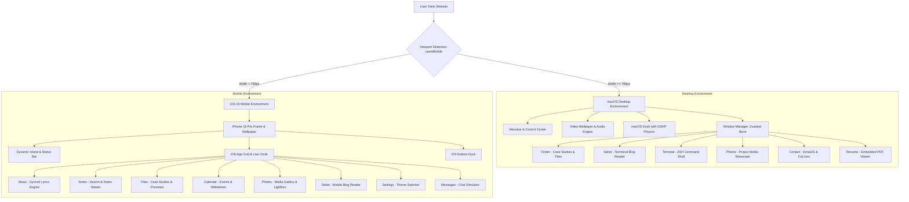

# macOS & iOS Portfolio Operating System

[](https://macos-portfolio-phi-ruby.vercel.app/)
[](https://github.com/Pratham707-S/Mac_OS_Portfolio_Practice_React_GSAP_Tailwind)

A web-based simulation of macOS Sequoia for desktop computers and iOS 18 for mobile devices, built with React 19, Tailwind CSS v4, and GSAP. This project delivers an operating system experience directly in the browser, featuring draggable windows, a desktop dock with magnification physics, a terminal command parser with Easter eggs, a synchronized lyrics music player, and structured project case studies.


---

## Table of Contents

1. [Project Overview](#project-overview)
2. [System Architecture and Flow](#system-architecture-and-flow)
3. [Packages and Technologies Used (What & Why)](#packages-and-technologies-used-what--why)
4. [Responsive Design: Desktop vs Mobile Architecture](#responsive-design-desktop-vs-mobile-architecture)
5. [Directory and File Structure](#directory-and-file-structure)
6. [Desktop Components and Features](#desktop-components-and-features)
7. [Mobile Components and Features (iOS 18 Suite)](#mobile-components-and-features-ios-18-suite)
8. [Terminal Command Reference](#terminal-command-reference)
9. [Installation and Local Setup](#installation-and-local-setup)
10. [License and Author](#license-and-author)

---

## Project Overview

Traditional developer portfolios often use static cards and generic grid layouts. This project recreates the look and feel of modern Apple operating systems:

- **Desktop Experience (macOS Sequoia)**: Delivers a multi-window desktop with movable windows, proximity-scaled dock magnification, a functional menubar with a Control Center, video wallpaper with audio controls, and an authentic ZSH terminal emulator.
- **Mobile Experience (iOS 18)**: Automatically provides an iPhone interface on mobile screens, complete with a Dynamic Island, status bar, spring-loaded app grid, bottom dock, full-screen iOS applications, and a live synchronized lyrics music player.

---

## System Architecture and Flow

### 1. Application Flow Diagram



### 2. State and Data Flow Diagram

```mermaid
graph LR
    subgraph Global State Stores
        ZustandStore[Zustand Store: window.js]
        ThemeStore[Theme Hook: useSystemTheme.js]
        ResponsiveStore[Viewport Hook: useIsMobile.js]
    end
    
    subgraph Desktop Consumers
        ZustandStore --> WindowWrapper[WindowWrapper HOC]
        ZustandStore --> DesktopDock[Dock.jsx]
        ThemeStore --> NavbarComp[Navbar.jsx]
        ThemeStore --> ControlCenterComp[ControlCenter.jsx]
    end
    
    subgraph Mobile Consumers
        ResponsiveStore --> RootApp[App.jsx]
        ThemeStore --> MobileSettings[IPhoneSettingsApp.jsx]
        ThemeStore --> MobileHome[IPhoneHomeScreen.jsx]
    end
    
    subgraph External Services
        EmailJS[@emailjs/browser] --> ContactWindow[Contact.jsx]
        CanvasConfetti[canvas-confetti] --> TerminalEasterEgg[Terminal.jsx: love command]
    end
```

---

## Packages and Technologies Used (What & Why)

Here is the complete list of packages and tools used in this project, explained in plain English:

### 1. React 19 (`react`, `react-dom`)
- **What it is**: The core JavaScript library for building user interfaces.
- **Why we use it**: It allows us to build the operating system as modular, reusable components (windows, apps, menus, buttons). React 19 provides fast rendering and clean state management hooks (`useState`, `useEffect`, `useRef`, `useCallback`) to manage complex multi-window states smoothly.

### 2. GSAP and @gsap/react (`gsap`, `@gsap/react`)
- **What it is**: GreenSock Animation Platform, an industry-standard JavaScript animation and physics library.
- **Why we use it**: 
  - **Dock Magnification**: Powers the macOS dock icon zoom effect. As the user moves their cursor across the dock, GSAP calculates the proximity distance and scales icons up with smooth mathematical curves.
  - **Draggable Windows**: Powers the `Draggable` plugin used in `WindowWrapper.jsx`, allowing users to drag windows anywhere on the screen with realistic boundaries.
  - **App Transitions**: Provides smooth opening and closing animations for windows and panels.

### 3. Tailwind CSS v4 (`tailwindcss`, `@tailwindcss/vite`)
- **What it is**: A modern utility-first CSS framework.
- **Why we use it**: Allows us to style components directly inside JSX using utility classes without writing separate large CSS files. Tailwind v4 brings native CSS variables, instant compilation, glassmorphism filters (`backdrop-blur`), and responsive breakpoints (`md:`, `lg:`).

### 4. Zustand (`zustand`)
- **What it is**: A lightweight, fast state management library for React.
- **Why we use it**: Manages the global window state (`store/window.js`). It tracks which windows are open, minimized, maximized, focused, or closed, along with their coordinates and `z-index` layering, without the boilerplate of Redux.

### 5. Lucide React (`lucide-react`)
- **What it is**: A collection of clean, consistent vector SVG icons.
- **Why we use it**: Provides lightweight UI icons across both macOS and iOS interfaces, including connectivity icons (Wi-Fi, Bluetooth, AirDrop), media controls (Play, Pause, Skip), window controls, file icons, and navigation arrows.

### 6. canvas-confetti (`canvas-confetti`)
- **What it is**: A lightweight HTML5 canvas particle generator.
- **Why we use it**: Renders heart-shaped particle confetti bursts at 60 FPS when a visitor types the interactive `love` Easter egg command inside the Terminal.

### 7. @emailjs/browser (`@emailjs/browser`)
- **What it is**: A client-side SDK that sends emails directly from the browser through the EmailJS service.
- **Why we use it**: Allows visitors to submit messages in the Contact window and have them delivered directly to Pratham's inbox without requiring an independent Node.js backend server.

### 8. Day.js (`dayjs`)
- **What it is**: A minimalist JavaScript library for parsing, validating, and formatting dates.
- **Why we use it**: Formats the live menubar clock (`Tue Sep 15 10:45 PM`), terminal session timestamps, and calendar dates with minimal bundle size impact.

### 9. Vite 8 (`vite`)
- **What it is**: A next-generation frontend build tool and local development server.
- **Why we use it**: Delivers instant Hot Module Replacement (HMR) during local development and bundles optimized production code using Rollup.

---

## Responsive Design: Desktop vs Mobile Architecture

The application uses an adaptive architecture managed by the custom `useIsMobile.js` hook:

### Breakpoint Strategy
- **Screen Width >= 768px (Desktop & Laptop)**: Renders the **macOS Sequoia** environment.
- **Screen Width < 768px (Mobile & Small Tablets)**: Automatically switches to the **iPhone iOS 18** environment.

### How Each Mode Works

#### Desktop macOS Mode
- **Multi-Window Multi-Tasking**: Multiple applications can be opened simultaneously. Users can drag windows, overlap them, minimize them to the dock, and maximize them to full screen.
- **Z-Index Layering**: Clicking any window immediately elevates its `z-index`, bringing it to the front of the workspace.
- **Authentic macOS Dock**: Positioned at the bottom of the screen with cursor-proximity magnification and active indicator lights.
- **Desktop Menubar**: Top bar with an Apple logo menu, active app title, battery status, search, Control Center flyout, and live clock.

#### Mobile iOS 18 Mode
- **Full-Screen Single-Task Flow**: Applications open full-screen inside a native iPhone frame.
- **Dynamic Island & Status Bar**: Displays carrier signal bars, Wi-Fi icon, battery percentage, and live time.
- **Spring-Loaded App Grid**: A 4x4 app grid with smooth touch feedback and dynamic badges.
- **Gesture Navigation**: Swipe gestures and bottom home-bar touches to return home or switch apps.

---

## Directory and File Structure

```text
MAC-OS-portfilio-pratice-react_and_gsap/
├── public/
│   ├── apple-icon-folder/      # iOS system app icons (Calendar, Notes, Music, Files, Settings, Photos)
│   ├── icons/                  # macOS menubar icons (Apple logo, Wi-Fi, Control Center, Spotlight Search)
│   ├── images/                 # Project showcase screenshots, author photo, terminal vector icon (terminal.svg)
│   ├── mobileformusci/         # Audio tracks and artwork for the iOS Apple Music player
│   ├── video-background/       # Background video wallpapers (high-definition automotive and scenery loops)
│   └── Resume.pdf              # Downloadable curriculum vitae PDF
├── src/
│   ├── assets/                 # Reusable static SVGs and vector graphics
│   ├── components/
│   │   ├── mobile/             # iOS Mobile Interface Suite
│   │   │   ├── apps/           # Standalone iPhone apps
│   │   │   │   ├── IPhoneCalendarApp.jsx  # Calendar app with academic and GATE milestones
│   │   │   │   ├── IPhoneFilesApp.jsx     # Files app with structured project case studies
│   │   │   │   ├── IPhoneMessagesApp.jsx  # Messages app with automated interactive chat
│   │   │   │   ├── IPhoneMusicApp.jsx     # Apple Music player with real-time synchronized lyrics
│   │   │   │   ├── IPhoneNotesApp.jsx     # Notes app with search and full-screen note viewer
│   │   │   │   ├── IPhonePhotosApp.jsx    # Photos app with project gallery and lightbox
│   │   │   │   ├── IPhoneSafariApp.jsx    # Mobile Safari browser for technical articles
│   │   │   │   └── IPhoneSettingsApp.jsx  # Settings app with Dark/Light theme toggles
│   │   │   ├── data/           # Data feeds for mobile applications
│   │   │   │   ├── mobileAppsData.js      # Project metadata, case study texts, and app registry
│   │   │   │   └── resumeData.js          # Structured resume data (experience, education, skills)
│   │   │   ├── ui/             # Reusable mobile UI building blocks
│   │   │   │   ├── IPhoneAppGrid.jsx      # Spring-loaded home screen application grid
│   │   │   │   ├── IPhoneBottomDock.jsx   # Pinned bottom dock on iPhone home screen
│   │   │   │   └── IPhoneStatusBar.jsx    # Status bar with Dynamic Island, Wi-Fi, and battery
│   │   │   └── IPhoneHomeScreen.jsx       # Root iPhone container managing active mobile app view
│   │   ├── navbar-panels/      # Desktop menubar dropdown drawers
│   │   │   ├── ControlCenter.jsx          # Brightness slider, volume slider, connectivity toggles
│   │   │   ├── ProfilePanel.jsx           # Developer summary card and quick social links
│   │   │   └── WifiPanel.jsx              # Wi-Fi network selector and IP info
│   │   ├── Dock.jsx            # Desktop macOS dock with GSAP cursor proximity scaling
│   │   ├── Navbar.jsx          # Desktop top menubar with clock and system dropdowns
│   │   ├── VideoBackground.jsx # Desktop HTML5 video wallpaper with audio controls
│   │   ├── WindowControls.jsx  # macOS traffic light window buttons (Close, Minimize, Maximize)
│   │   └── MacNotification.jsx # macOS desktop slide-in toast notification banner
│   ├── constants/
│   │   └── index.js            # Desktop file system structure, dock apps registry, and case studies
│   ├── hoc/
│   │   └── WindowWrapper.jsx   # Higher-Order Component with GSAP Draggable physics and z-index ordering
│   ├── hooks/
│   │   ├── useIsMobile.js      # Viewport listener checking for mobile breakpoint (768px)
│   │   └── useSystemTheme.js   # Global Dark/Light theme controller and listener
│   ├── store/
│   │   └── window.js           # Zustand global state store for desktop window management
│   ├── utils/
│   │   └── emailService.js     # EmailJS configuration and submission handler
│   ├── windows/                # Desktop macOS Application Windows
│   │   ├── Contact.jsx         # Contact form with EmailJS and Cal.com appointment scheduler
│   │   ├── Finder.jsx          # File manager with nested folders, case studies, and draggable icons
│   │   ├── ImgFile.jsx         # High-resolution image preview window for Finder
│   │   ├── Photos.jsx          # Project gallery with video showcases and lightbox modal
│   │   ├── Resume.jsx          # Embedded PDF resume reader with download trigger
│   │   ├── Safari.jsx          # Developer blog reader with Medium integration
│   │   ├── Terminal.jsx        # Authentic macOS ZSH terminal emulator with command parser
│   │   └── TxtFile.jsx         # Case study text document reader for Finder
│   ├── App.jsx                 # Main application root switching between Desktop and Mobile
│   ├── index.css               # Global Tailwind CSS tokens, typography, and utility classes
│   └── main.jsx                # React DOM root mounting
├── package.json                # Project dependencies, scripts, and metadata
├── vite.config.js              # Vite configuration and path resolution aliases
└── README.md                   # Technical project documentation
```

---

## Desktop Components and Features

### 1. Window Manager (`src/hoc/WindowWrapper.jsx` and `src/store/window.js`)
- **GSAP Drag Engine**: Every desktop window is wrapped by `WindowWrapper.jsx`, giving it smooth dragging physics restricted to the viewport boundaries.
- **Focus Management**: Clicking any part of a window brings it to the top of the stack (`z-index` elevation).
- **Traffic Light Controls**: Functional close (red), minimize (yellow), and maximize (green) buttons.

### 2. Finder (`src/windows/Finder.jsx`)
- **Directory Hierarchy**: Sidebar navigation with `Work`, `About me`, `Resume`, and `Trash` sections.
- **Structured Project Case Studies**:
  - **KP Store (Apple E-Commerce)**: Includes `Architecture.txt` (tech breakdown), `Design.fig` (Figma wireframe), `Screenshot.png` (UI preview), `kp-store.com` (live URL), and `TLDR.txt` (summary).
  - **Redefine Gaming (3D Showcase)**: Includes `Motion-Specs.txt` (GSAP animation breakdown), Figma design link, live site launcher, and summary.
  - **JWT Auth (Security Guide)**: Dual-token security architecture specification, Medium article link, and summary.
  - **macOS & iOS Portfolio OS**: Complete system architecture blueprint, GitHub repo link, and summary.
- **Draggable Files**: File and folder icons inside Finder can be rearranged by the user.

### 3. Terminal (`src/windows/Terminal.jsx`)
- **macOS ZSH Styling**: Styled with a dark graphite background, magenta folder icon, and clean top header.
- **Command Parser**: Handles queries for skills, bio, career goals, future roadmap, projects, resume, and contact links.
- **Interactive Easter Egg**: Typing `love` triggers glowing ASCII heart art and a heart-shaped `canvas-confetti` particle burst.
- **Clickable Shortcuts**: The welcome message includes clickable command suggestions.

### 4. Safari (`src/windows/Safari.jsx`)
- **Technical Blog Reader**: Clean layout displaying technical articles and architecture breakdowns.
- **Real-Time Search**: Instant search bar filtering articles by title, tag, or content.
- **Medium Integration**: Dedicated article card for Pratham's published JWT dual-token authentication guide.

### 5. Photos (`src/windows/Photos.jsx`)
- **Categorized Sidebar**: Filter by `Library`, `Videos`, `People`, and `Favorites`.
- **Embedded Video Previews**: Live HTML5 video loops embedded inside project cards.
- **Lightbox Modal**: Full-screen image preview with direct project links.

### 6. Contact (`src/windows/Contact.jsx`)
- **EmailJS Form**: Functional contact form that sends messages directly to Pratham's inbox.
- **One-Click Connectors**: Direct shortcuts to LinkedIn, GitHub, and Cal.com meeting booking.

### 7. Desktop Dock (`src/components/Dock.jsx`)
- **Proximity Magnification**: GSAP calculates mouse distance to scale icons smoothly as the cursor glides across the dock.
- **Running Indicators**: Glowing white dots indicate active open applications.
- **Bounce Animations**: Opening an application triggers a natural macOS bounce animation.

### 8. Menubar & Control Center (`src/components/Navbar.jsx` and `src/components/navbar-panels/`)
- **Control Center**: Interactive sliders for screen brightness overlay and wallpaper audio volume, plus toggles for Wi-Fi, Bluetooth, and AirDrop.
- **Live Clock**: Formatted with Day.js showing live ticking date and time.
- **Profile Summary**: Quick summary dropdown with academic credentials and social links.

---

## Mobile Components and Features (iOS 18 Suite)

### 1. Apple Music (`src/components/mobile/apps/IPhoneMusicApp.jsx`)
- **HTML5 Audio Player**: Play, pause, scrub timeline, and switch between tracks.
- **Synchronized Lyrics Engine**: Reads timestamped lyric files, highlights the active lyric line in sync with playback, and automatically scrolls the view.

### 2. Notes (`src/components/mobile/apps/IPhoneNotesApp.jsx`)
- **Searchable Notes**: Real-time search filter across developer notes, system designs, and roadmaps.
- **Full-Screen Reader**: Rich text view with formatted code blocks and bullet points.

### 3. Files (`src/components/mobile/apps/IPhoneFilesApp.jsx`)
- **Mobile Project Explorer**: Browse project folders with case studies, architecture notes, screenshots, and live launch buttons.
- **About Me Section**: Personal bio, skill chips, and resume download.

### 4. Calendar (`src/components/mobile/apps/IPhoneCalendarApp.jsx`)
- **Monthly Calendar Grid**: Highlights current date and upcoming academic and GATE milestones.

### 5. Photos (`src/components/mobile/apps/IPhonePhotosApp.jsx`)
- **Media Gallery**: Responsive grid of project showcases with full-screen lightbox preview.

### 6. Settings (`src/components/mobile/apps/IPhoneSettingsApp.jsx`)
- **Theme Switcher**: Instant Dark Mode and Light Mode toggle that updates the entire mobile interface.
- **Device Information**: Displays simulated iOS version, storage breakdown, and author profile.

### 7. Messages (`src/components/mobile/apps/IPhoneMessagesApp.jsx`)
- **Interactive Chat Simulator**: Simulated conversation interface with predefined prompt responses.

---

## Terminal Command Reference

| Command | Aliases | Output / Action |
| :--- | :--- | :--- |
| `search pratham` | `search`, `bio`, `whoami`, `about` | Prints full developer biography, MCA scholar status, GATE exam goals, future stack, resume link, and live projects. |
| `skills` | `techstack`, `tech`, `cat tech-stack.json` | Prints complete categorized technical stack (Languages, Frontend, Backend, Databases, Tools). |
| `goals` | `future` | Prints academic roadmap (MCA with distinction, GATE CS/IT preparation, open source goals). |
| `future-stack` | `ai`, `ml`, `dsa`, `cpp` | Prints future learning horizons (C++, Advanced DSA, AI & Machine Learning with PyTorch). |
| `projects` | - | Lists featured live projects with direct browser launch URLs. |
| `resume` | `cv`, `pdf` | Generates official resume PDF download link. |
| `contact` | `email` | Displays email address, LinkedIn profile URL, and Cal.com booking link. |
| `love` | `<3`, `heart`, `love you` | Triggers a heart-shaped canvas-confetti particle burst and prints glowing ASCII heart art with developer message. |
| `date` | - | Prints current system timestamp. |
| `clear` | - | Clears the terminal output buffer. |
| `help` | `?`, `h`, `commands` | Displays the interactive command guide with clickable shortcuts. |

---

## Installation and Local Setup

### Prerequisites
- **Node.js**: Version 18.0 or higher
- **npm**: Version 9.0 or higher

### Step-by-Step Setup

1. **Clone the repository**:
   ```bash
   git clone https://github.com/Pratham707-S/Mac_OS_Portfolio_Practice_React_GSAP_Tailwind.git
   cd Mac_OS_Portfolio_Practice_React_GSAP_Tailwind
   ```

2. **Install all dependencies**:
   ```bash
   npm install
   ```

3. **Start the local development server**:
   ```bash
   npm run dev
   ```
   Open `http://localhost:5173` in your browser.

4. **Build for production**:
   ```bash
   npm run build
   ```

5. **Preview production build locally**:
   ```bash
   npm run preview
   ```

---

## License and Author

This project is open-source and available under the [MIT License](LICENSE).

Developed and designed by [Pratham Tiwari](https://github.com/Pratham707-S).
